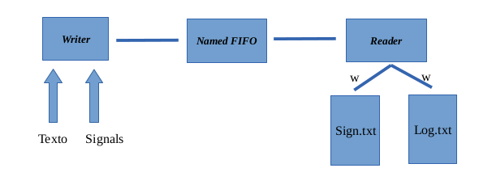

# Goal
Communicate two processes through a named fifo. The Writer process will be able to receive text by
console and signals. The Reader process must log in a file the text that the process will receive from the writer and in another file the signals that the Writer process receives by itself.

# Parts of the system:
Writer process:
This process will start and wait for the user to enter text until they press ENTER. At that time it will write the data in a named fifo with the following format:
````
DATA: XXXXXXXXX
````

At any time the process may receive the SIGUSR1 and SIGUSR2 signals. In that case following message shall be written in the named fifo:
```
SIGN:1
``` 
or  
```
SIGN:2
```

# Reader process:
This process will read the data from the named fifo and according to the header "DATA" or "SIGN" it will write to the
file log.txt or signals.txt.

# System architecture:

